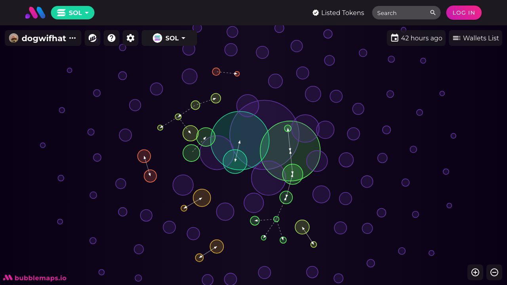

# Bubblemaps Telegram Bot 🤖
TG: @Bubblemaps_Telegram_Bot

A Telegram bot that provides detailed token analytics, decentralization scores, and interactive Bubblemaps visualizations across multiple blockchains.



## Features ✨

- **Multi-Chain Support**: Ethereum, BSC, Fantom, Avalanche, Cronos, Arbitrum, Polygon, Base, Solana, Sonic
- **Token Analytics**: Market cap, price, volume, supply distribution
- **Decentralization Score**: AI-powered score (1-100) with detailed breakdown
- **Holder Analysis**: Top 10 holders with contract/CEX identification
- **Interactive Visualization**: Direct links to Bubblemaps + blockchain explorers
- **CoinGecko Integration**: Real-time market data

## Installation 💻

### Prerequisites

- Node.js v18+
- npm v9+
- Google Chrome (for Puppeteer)
- Telegram Bot Token ([Get from @BotFather](https://t.me/BotFather))

### Steps

1. Clone repository:

```bash
git clone https://github.com/patrick-ehimen/bubblemap-tg-bot.git
cd bubblemap-tg-bot
```

2. Install dependencies:

```bash
npm install
```

3. Create .env file:

```dotnetcli
TELEGRAM_BOT_TOKEN=your_bot_token
COINGECKO_API_KEY=your_coingecko_key
```

## Usage 📲

### Basic Commands

- `/start` - Initial bot setup
- `/help` - Usage instructions

### Workflow

1. Send contract address to the bot:

`0x603c7f932ed1fc6575303d8fb018fdcbb0f39a95`dotnetcli

2. Select blockchain network

3. Receive analysis:

- Bubblemap visualization

- Decentralization score

- Market data from CoinGecko

- Supply distribution breakdown

- Explorer links

## Architecture 🏗️

### Key Dependencies

| Package   | Purpose                                    |
| --------- | ------------------------------------------ |
| telegraf  | Telegram bot framework                     |
| puppeteer | Headless browser for Bubblemap screenshots |
| axios     | HTTP client for API interactions           |
| numeral   | Number formatting                          |

### Data Flow

1. User sends contract address

2. Address validation with regex patterns

3. Chain selection via inline keyboard

4. Data aggregation:

- Bubblemaps API → Token distribution

- CoinGecko → Market data

5. Decentralization score calculation

6. Puppeteer generates visualization

7. Formatted response sent via Telegram

### Deployment 🚀

Render.com Setup

1. Create new Web Service

2. Use render.yaml configuration

3. Set environment variables

4. Enable auto-deploy
